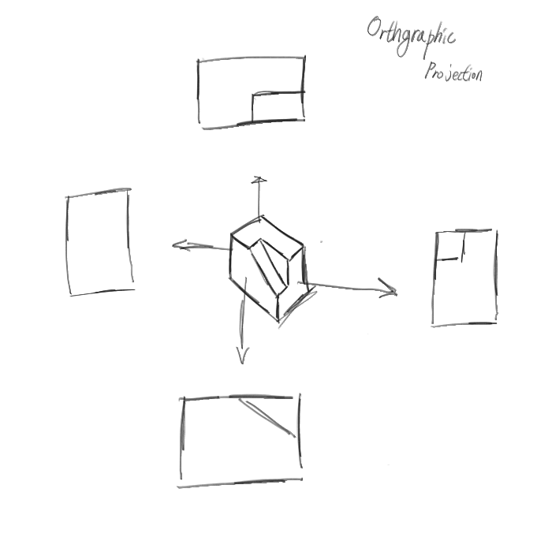

# 직교투영 (Orthgraphic Projection)

가장 간단한 투영 방법중 하나로, 축 하나의 정보를 무시하는 방법.

투상도를 그리는 행위와 동일하다.


<figure><figcaption><p>이와 비슷한 그림을 학창시절에 그려 본 적 있을겁니다.</p></figcaption></figure>

코드로 표현한다면 다음과 같이 구현 할 수 있다.

```c
// 3d vector 구조체
typedef struct {
    float x,
    float y,
    float z,
} vec3;

// 2d vector 구조체
typedef struct {
    float x,
    float y,
} vec2;

// z 축 성분을 무시한다.
vec2 orthogonal_projection (vec3 vertex) {
    return (vec2) {
        .x = vertex.x,
        .y = vertex.y,
    };
}
```

